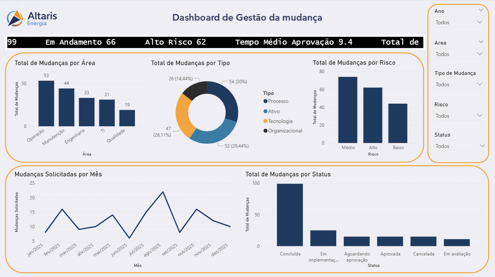

# Dashboard de Gestão de Mudanças — Altaris Energia

## Descrição

Este projeto apresenta um **dashboard analítico desenvolvido em Power BI** para monitoramento do processo de **Gestão de Mudanças (Management of Change — MoC)** em uma empresa fictícia do setor de energia chamada **Altaris Energia**.

O objetivo do dashboard é fornecer uma visão consolidada das mudanças organizacionais, permitindo acompanhar indicadores estratégicos como volume de mudanças, distribuição por área, riscos associados, status do fluxo e tempo médio de aprovação.

A solução permite apoiar a **governança de mudanças organizacionais**, reduzindo riscos operacionais e melhorando a visibilidade sobre o processo de aprovação e implementação.

---

## Dashboard

)

---

## Estrutura do Dashboard

O painel apresenta indicadores e visualizações que permitem analisar o processo de gestão de mudanças sob diferentes perspectivas.

### Indicadores principais (KPIs)

- Total de mudanças registradas
- Mudanças em andamento
- Mudanças concluídas
- Mudanças classificadas como alto risco
- Tempo médio de aprovação das mudanças

### Visualizações

O dashboard inclui análises como:

- Distribuição de mudanças por **Área**
- Distribuição por **Tipo de Mudança**
- Classificação de mudanças por **Nível de Risco**
- Evolução mensal de **Mudanças Solicitadas**
- Análise de **Status das Mudanças**

Essas visualizações permitem identificar tendências, riscos e áreas com maior concentração de mudanças organizacionais.

---

## Estrutura de Dados

A base utilizada no projeto foi construída com **dados fictícios**, contendo aproximadamente **180 registros de mudanças** ao longo de um período anual.

Campos principais utilizados:

- ID da Mudança
- Área Responsável
- Tipo de Mudança
- Data de Solicitação
- Data de Aprovação
- Data de Implementação
- Status
- Nível de Risco
- Responsável

Também foi criada uma **tabela calendário** para permitir análises temporais e garantir consistência nas visualizações ao longo do tempo.

---

## Principais Métricas (DAX)

Algumas das medidas desenvolvidas no projeto incluem:

- Total de Mudanças
- Mudanças em Andamento
- Mudanças Concluídas
- Mudanças de Alto Risco
- Tempo Médio de Aprovação
- Mudanças Aprovadas por Período
- Mudanças Implementadas por Período

Funções DAX utilizadas:

- `CALCULATE`
- `DATEDIFF`
- `USERELATIONSHIP`
- `SWITCH`
- `ROUND`
- `FORMAT`

---

## Ferramentas Utilizadas

- **Power BI**
- **DAX (Data Analysis Expressions)**
- **Modelagem de dados**
- **Relacionamentos entre tabelas**
- **Tabela calendário**

---

## Objetivo do Projeto

Este projeto foi desenvolvido como parte de um **portfólio de análise de dados e melhoria de processos**, demonstrando habilidades em:

- Modelagem de dados
- Construção de métricas analíticas com DAX
- Desenvolvimento de dashboards executivos
- Visualização de indicadores de processos
- Aplicação de conceitos de **governança e gestão de mudanças**

O cenário simula um ambiente corporativo para análise de processos organizacionais.

---

## Observação

A empresa **Altaris Energia** é fictícia e foi criada apenas para fins demonstrativos neste projeto.

Todos os dados utilizados são **simulados**, com o objetivo de demonstrar técnicas de modelagem e análise de dados em Power BI.

---

## Autora

**Gabriela Cerqueira**
